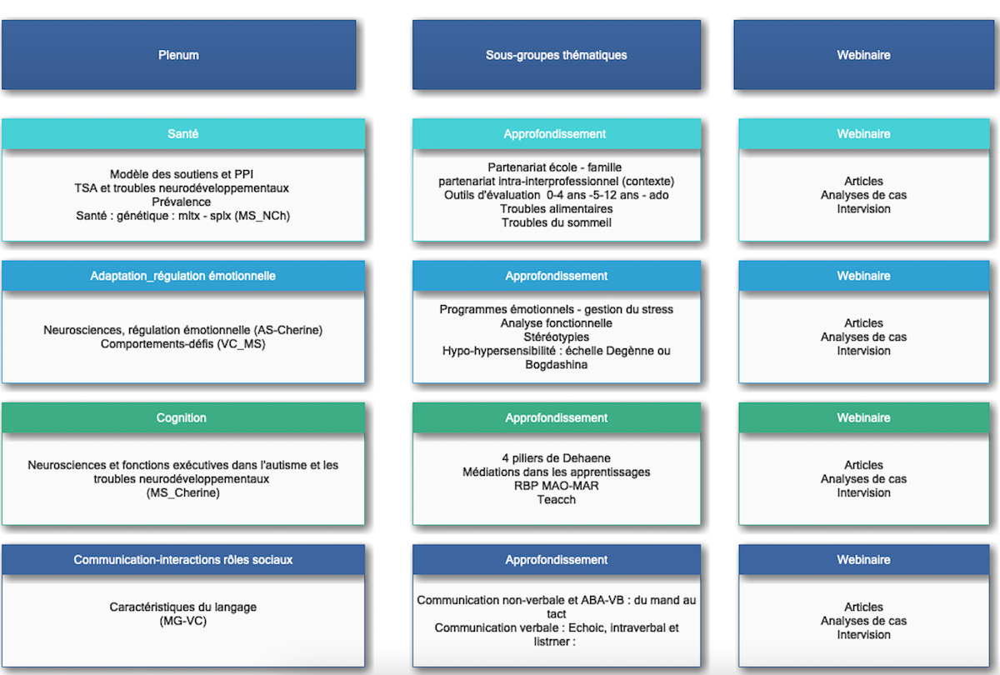

```{r setup, include=FALSE}
options(htmltools.dir.version = FALSE)
knitr::opts_chunk$set(
  fig.width = 9, fig.height = 3.5, fig.retina = 3,
  out.width = "100%",
  cache = FALSE,
  echo = TRUE,
  message = FALSE,
  warning = FALSE,
  fig.show = TRUE,
  hiline = TRUE
)
```

```{r xaringan-themer, include=FALSE, warning=FALSE}
library(xaringanthemer)
style_duo_accent(
  primary_color = "#D2202B",
  secondary_color = "#D2202B",
  inverse_header_color = "#FFFFFF",
  link_color = "#676C72",
    header_font_google = google_font("Josefin Sans")

)
```

class: title-slide, inverse, bottom
background-image: url(`r rmarkdown::metadata$url_unsplash`)
background-size: cover

# `r rmarkdown::metadata$title`

## `r rmarkdown::metadata$subtitle`

### `r rmarkdown::metadata$team`

### `r rmarkdown::metadata$date`

---
class: about-me, middle, center


## Formation continue HEP-VS

[`r icons::fontawesome("link")` Espace Teams du projet](https://teams.microsoft.com/l/team/19%3a8hSifiHR96Z6lfbhzdYt1xp3qiP-67mxr8Csh9dxnLM1%40thread.tacv2/conversations?groupId=5747d26d-b680-4386-abf2-965b3f532137&tenantId=5836f016-62a4-4d3b-a32c-4623b49c8e34)</br>

---
class: inverse, middle left

# Ordre du jour

--

1. Accueil

--

1. Approbation du PV de la séance 1

--

1. Nouvelles relatives à l'avancement du projet de formation

--

1. Travail du Groupe Consultatif sur la question des technologies et celle des présentiels en petits groupes, et celle du délivrable

--

1. Divers

---
class: middle

## Approbation du PV de la séance 1

--

Le PV est [à disposition sur Teams](https://hepvsch.sharepoint.com/:w:/s/FormationcontinuedesESduVSRomand2022-2024/EW0-fLjX8l5Mveg7CEp-kswBh_baaglJ0nILHKDzri33Rw?e=E7TOcm)

---
class: middle

## Nouvelles relatives à l'avancement du projet de formation

--

- Position du Service de l'enseignement

--

- Activités du Conseil scientifique

---
class: middle

## Commentaires du Groupe Consultatif

--

- Technologies utilisées et intensité

--

- Présentiels en petits groupes

--

- Délivrable et mutualisation

---
class: middle center

```{r out.width = '70%', echo=FALSE}
# local

```

*[Modèle en élaboration par le CS, au 10.01.22](https://hepvsch.sharepoint.com/:f:/s/FormationcontinuedesESduVSRomand2022-2024/EhCMTr8EjX1Gg1upL1xfxsQBoH6hcmwRXoKLSFPvQaupMA?e=CqycH6)*
---
class: middle center

```{r out.width = '80%', echo=FALSE}
# local
knitr::include_graphics("img/deliv.png")
```

*[Proposition de document pour cadrer le délivrable, en cours de réflexion par le CS, au 10.01.22](https://hepvsch.sharepoint.com/:f:/s/FormationcontinuedesESduVSRomand2022-2024/EhCMTr8EjX1Gg1upL1xfxsQBoH6hcmwRXoKLSFPvQaupMA?e=CqycH6)*

---
class: middle

## Divers

- Prochaines étapes du projet (variante optimiste)
    - Feu vert financier (janvier)
    - Clarification des rapports entre institutions (février)
    - Engagement des équipes de formation (avril)
    
- Groupe consultatif 
    - Souhaits pour la suite

    

---
class: middle

.left[

```{r out.width = '10%', echo=FALSE}
# local
knitr::include_graphics("img/logo.png")
```

]

--

.right[

Crédits Photos :

[Louis Hansel](https://unsplash.com/photos/Rf9eElW3Qxo)

]
